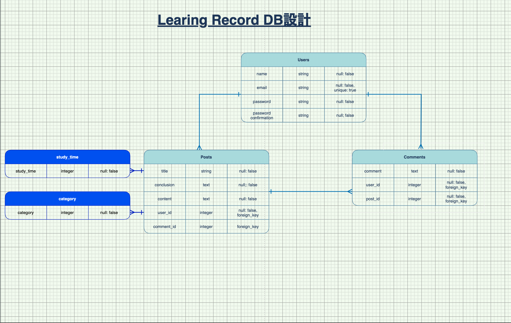

# アプリケーション名
Leaning Records

# アプリケーション概要
プログラミングを学習し始めた人に向けて作成した学習記録アプリです。  
検索機能もついているので、一度学習したことを振り返るのも簡単です。  
またモチベーションアップにも繋がるように学習時間も記録できるようにしました。  
マイページで自分が投稿した内容が一覧で確認できます。  

# URL
https://learning-records-29081.herokuapp.com/

# テスト用アカウント
アドレス:sample@sample.com  
パスワード:sample  

# Basic認証
ID:learning  
Pass:records  

# 利用方法
ユーザー登録をすると、学習した内容を記録することができます。  
ログインしているユーザーはコメントをすることができます。  
ログインしていないユーザーも投稿内容を閲覧することができます。  

# 目指した課題解決
アウトプットすることにハードルを感じている人や、何をアウトプットすれば良いかわからない人、
またはアウトプットの習慣がない人がアウトプットの練習の場として気軽に使えるように作成しました。  

学習のモチベーションにも繋がるように、学習時間も記録できるようにしました。  

また検索機能もあるので、一度学習した内容もすぐに振り返ることができるので、効率良く学習を進められます。

# 洗い出した用件
優先順位 （高：3、中：2、低：1） | 機能 | 目的 | 詳細 | ストーリー(ユースケース) | 見積もり（所要時間）
--- | --- | --- | --- | --- | ---
3 | ユーザー管理機能 | ユーザー管理のため。 | 新しくユーザー登録ができる。ユーザー登録が完了している場合、ログインすることができる。ログアウトできる。 | ・新規ユーザー登録画面から、新規登録が可能。 ・新規登録が完了するとログイン、ログアウトが可能。 | 5
3 | 学習内容投稿機能 | 学習した内容をアウトプットするため。 | 学習した内容を投稿できる。（タイトル、画像、結論、内容、カテゴリー、学習時間） | ・ログインしているユーザーは新規投稿ができる。 ・新規投稿画面から、タイトル、画像、結論、内容、カテゴリー、学習時間の投稿ができる。 | 8
3 | 学習内容一覧表示機能 | 投稿した内容を一覧で確認しやすくするため。 | 投稿した内容のタイトルと画像だけを一覧で表示し、見やすくする。 | ・トップ画面に投稿された内容のタイトルと画像を一覧表示する。一覧から閲覧したい投稿内容の詳細ページに遷移できる。 | 5
3 | 学習内容詳細表示機能 | 投稿した内容の詳細を確認するため。 | 見たい投稿内容の詳細を表示する。 | ・トップページの一覧から選択した投稿内容の詳細を表示する。（日付、投稿者名、タイトル、画像、結論、内容、カテゴリー、学習時間） | 5
3 | 学習内容編集機能 | 投稿した内容を編集するため。 | 投稿した内容の編集したい場合に編集ができる。編集ページにはすでに投稿した内容が表示されるようにする。 | ・投稿者本人のみに編集ボタンを表示し、編集が可能。 | 2
3 | 学習内容削除機能 | 投稿した内容を削除するため。 | 投稿した内容を削除したい場合に、削除ができる。 | ・投稿者本人のみに削除ボタンを表示し、削除が可能。 | 2
2 | コメント機能 | 投稿した内容に対してコメントができるようにするため。投稿した内容に対して、意見交換ができる。 | 新規登録、ログインしているユーザーのみ投稿内容にコメントができる。 | ・ユーザー登録、ログインが完了している場合、投稿内容に対してコメントができる。 | 3
2 | 検索機能 | 投稿した内容を検索できるようにするため。一度学習した内容を効率良く振り返るため。 | 見たい投稿内容のタイトルを検索できる。 | ・検索フォームから投稿されたタイトルから閲覧したいタイトルのキーワードを入力して検索し、表示できる。 | 5
2 | 複数画像投稿機能 | エラー文の画像など複数画像を投稿できるようにする。 | 投稿する画像のプレビュー機能と、複数枚画像を投稿できる。 | ・新規投稿画面から、画像を複数枚投稿できる。投稿前に選択した画像のプレビューを表示する。 | 5
2 | マイページ機能 | ログイン中のユーザーの投稿一覧を確認するため。 | ログイン中のユーザーのマイページを作成し、ログイン中のユーザーが投稿した内容を一覧表示する。 | ・ヘッダーのユーザー名からマイページに遷移し、ログイン中のユーザーの投稿一覧を表示。 | 5

# 実装した機能についての説明
* ユーザー登録  
新規ユーザー登録、ログイン、ログアウトができます。
ログインしているユーザーは新規投稿やコメントができます。

* 学習記録投稿機能  
学習内容を投稿できます。
結論から記入できるので、学習内容を整理しやすくしています。
学習時間やカテゴリーは選択式にし、簡単に登録できます。

* 学習記録一覧表示機能  
タイトルと画像を一枚表示し、どんな内容なのか一目でわかりやすいようにしています。

* 学習記録編集機能  
投稿したユーザー本人だけが投稿した学習内容を編集できます。

* 学習記録削除機能  
投稿したユーザー本人だけが投稿した学習内容を削除できます。

* コメント機能  
ログインしているユーザーはコメントを投稿できます。

* 検索機能  
キーワードを入力し、関連するタイトルの投稿を検索できます。

* マイページ作成
ログイン中のユーザーの投稿一覧が閲覧できます。

# 実装予定の機能
* ユーザーごとにマイページに遷移し、投稿一覧表示機能の実装
* ユーザーのマイページに総合学習時間の表示

# ローカルでの動作方法
## 開発環境
ruby '2.6.5'  
rails '~> 6.0.0'

# テーブル設計

## users テーブル

| Column                | Type   | Options                   |
| --------------------- | ------ | ------------------------- |
| name                  | string | null: false               |
| email                 | string | null: false, unique: true |
| password              | string | null: false               |
| password_confirmation | string | null: false               |

### Association

- has_many :posts
- has_many :comments

## posts テーブル

| Column              | Type       | Options                        |
| ------------------- | ---------- | ------------------------------ |
| title               | string     | null: false                    |
| conclusion          | text       | null: false                    |
| content             | text       | null: false                    |
| study_time_id       | integer    | null: false                    |
| category_id         | integer    | null: false                    |
| user_id             | integer    | null: false, foreign_key: true |
| comment_id          | integer    | null: false, foreign_key: true |

### Association

- belongs_to :user
- has_many :comments
- belongs_to_active_hash :study_time
- belongs_to_active_hash :category

## comments テーブル

| Column    | Type    | Options                        |
| --------- | ------- | ------------------------------ |
| user_id   | integer | null: false, foreign_key: true |
| post_id   | integer | null: false, foreign_key: true |
| text      | text    | null: false                    |

### Association

- belongs_to :user
- belongs_to :post